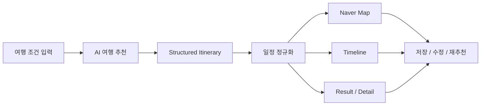
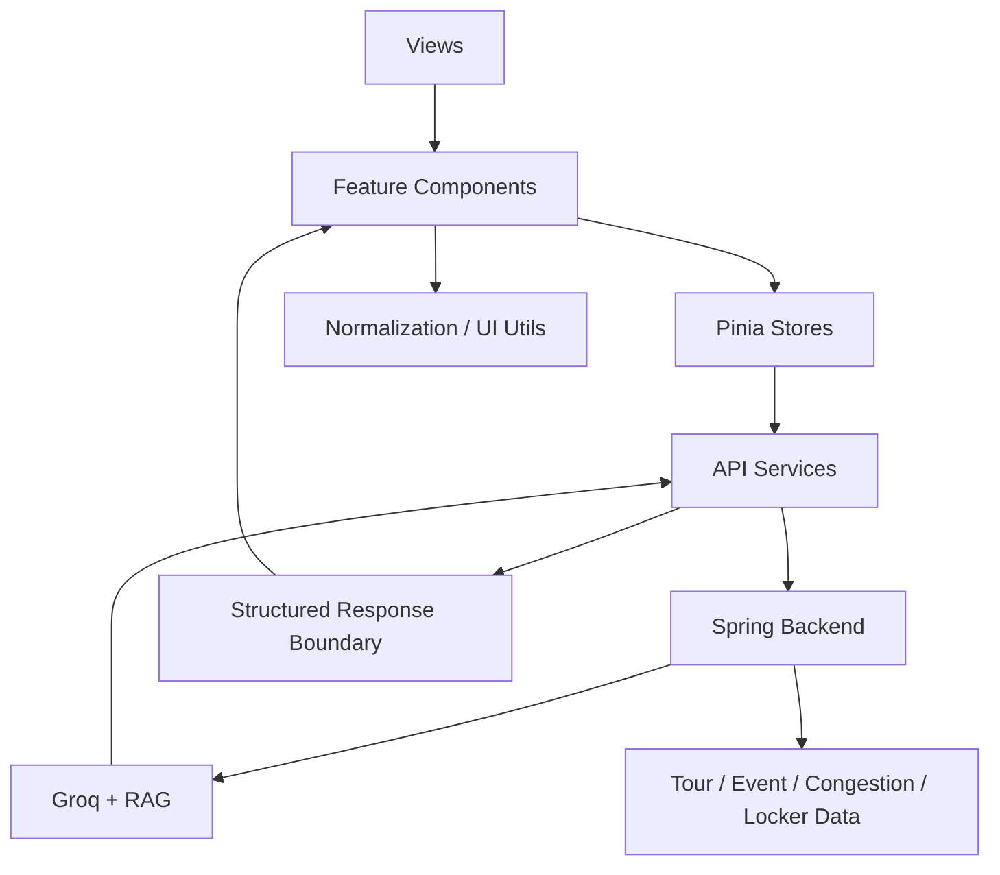
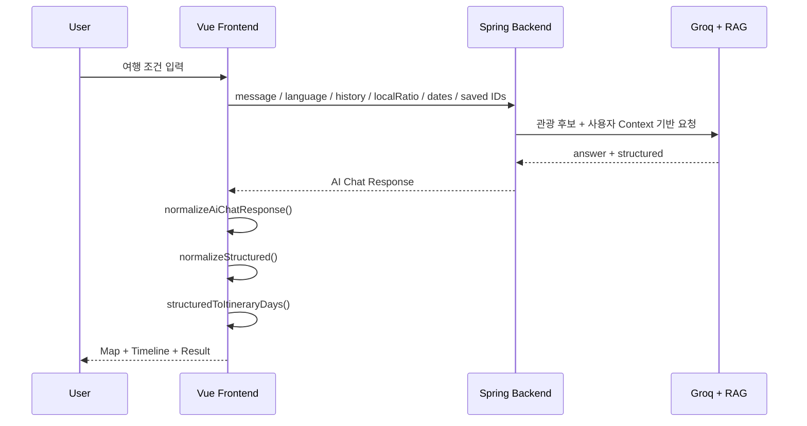
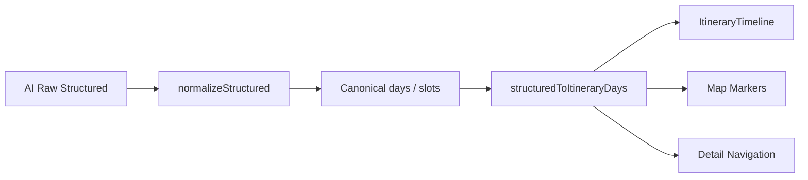
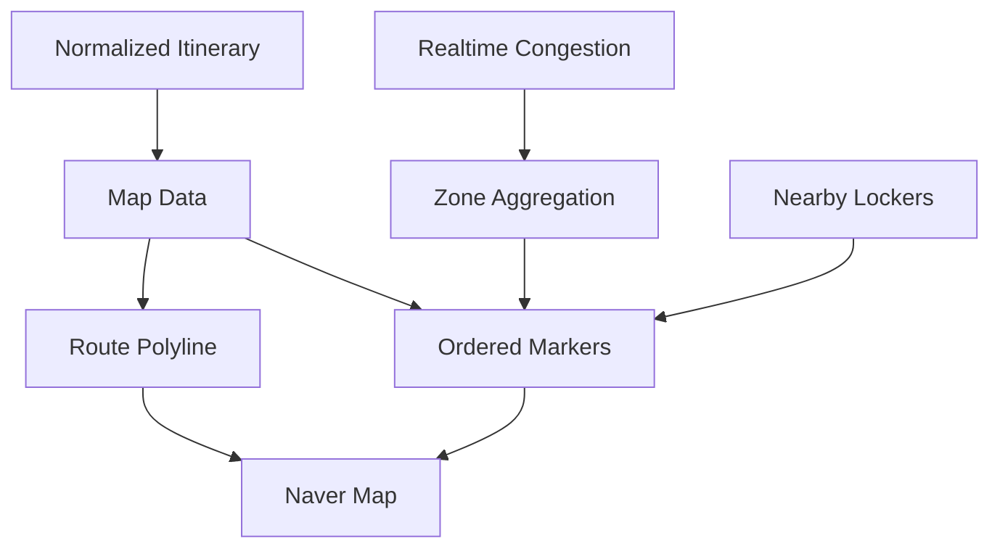
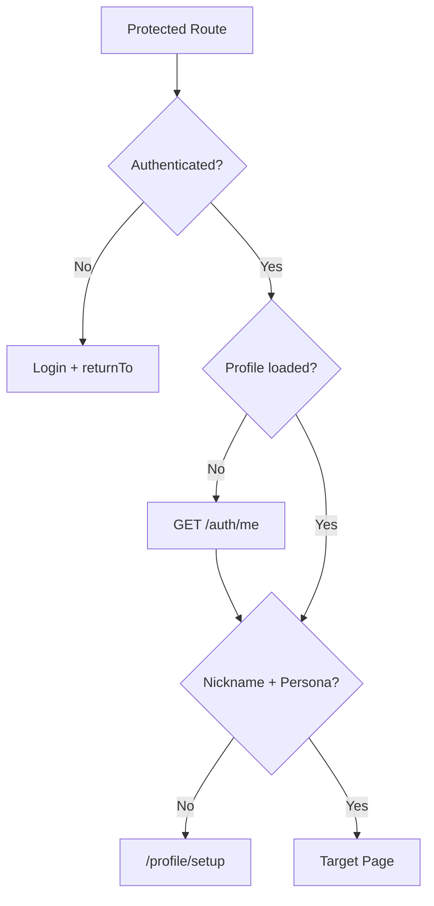
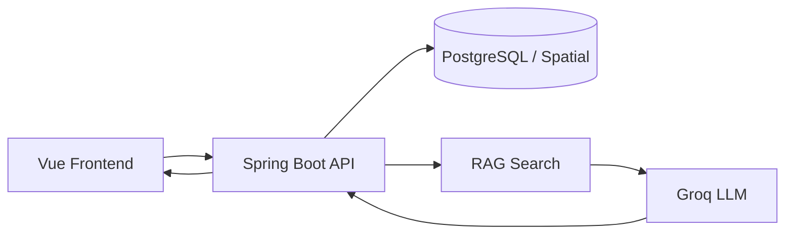

<div align="center">

# 🌏 Beyond Tours Seoul

### 실시간 서울 데이터와 AI를 연결해 여행자의 다음 목적지를 결정하는 여행 추천 웹앱

**AI Itinerary · Naver Map · Real-time Congestion · Multilingual · Personalized Travel**


</div>

---

## Overview

**Beyond Tours Seoul(BTS)**은 외국인 관광객이 서울에서 수많은 관광 정보를 직접 비교하는 대신, 자신의 여행 조건과 실시간 상황을 바탕으로 **“지금 어디를 가야 하는지”** 결정할 수 있도록 돕는 AI 여행 서비스입니다.

여행 기간·동행 유형·여행 스타일·관심사를 입력하면 AI가 일정 데이터를 생성하고, 프론트엔드는 이를 **지도·일정 타임라인·상세 장소·저장 일정**으로 변환합니다. 또한 서울 실시간 혼잡도, 관광지/행사 데이터와 사용자의 저장 항목을 연결해 단순 챗봇이 아닌 실제 여행 의사결정 UI로 구성했습니다.



---

## Core Experience

| 기능 | 설명 |
| --- | --- |
| 🤖 AI 여행 코스 생성 | 여행 기간, 동행, 스타일, 테마, 추가 요청을 기반으로 개인화 코스 생성 |
| 💬 맥락 기반 AI 채팅 | 이전 대화와 생성된 일정 요약을 함께 전달하여 후속 수정 요청 지원 |
| 🗺️ 지도 + 일정 통합 | AI 일정의 장소·좌표를 Naver Map 마커/동선과 타임라인에 동기화 |
| 🚦 실시간 혼잡도 | 서울 주요 POI 데이터를 권역 단위로 집계해 지도 위 혼잡 영역으로 표현 |
| 🧳 주변 보관함 | 여행 일정 중 장소 주변 보관함을 연결해 실제 이동 맥락에 포함 |
| 🔖 저장함 | 관광지·행사·AI 일정·공식 코스를 계정 기반으로 저장하고 재사용 |
| 🌐 다국어 | 한국어·영어·일본어·중국어 UI 및 API 언어 코드 연동 |
| 👤 개인화 온보딩 | 첫 로그인 시 닉네임과 여행 성향(Persona)을 설정하고 추천 Context에 활용 |

---

# Frontend Architecture



프론트엔드는 화면에서 API 응답 형태를 직접 해석하지 않도록 `services`와 `utils`에 데이터 경계를 두었습니다.

```text
src/
├─ components/
│  ├─ ai/             # AI 입력 시트 / 채팅 / 일정 스트립
│  ├─ itinerary/      # 일정 타임라인
│  ├─ map/            # Naver Map / 지도 UI
│  ├─ discover/       # 탐색 화면 기능
│  └─ layout/         # 공통 레이아웃 / Bottom Navigation
├─ services/          # Auth / AI / 관광지 / 행사 / 혼잡도 / 저장 API
├─ stores/            # Auth / Map / Trip / Saved 상태
├─ utils/             # Structured 응답 정규화 / 일정 변환 / 세션 처리
├─ locales/           # ko / en / ja / zh 번역 리소스
├─ router/            # 화면 이동 / 인증 / 온보딩 Guard
└─ views/             # 페이지 단위 화면
```

---

# AI Itinerary Pipeline

이 프로젝트의 핵심 프론트엔드 문제는 **LLM 응답을 화면에 그대로 출력하는 것이 아니라, 신뢰할 수 있는 여행 UI 데이터로 바꾸는 것**이었습니다.



## 1. AI Request Context

`aiChatService`는 현재 메시지뿐 아니라 다음 Context를 함께 전달할 수 있습니다.

- 최근 대화 History
- 여행 시작일 / 종료일
- 관광지 ↔ 로컬 선호도(`localRatio`)
- 로그인 사용자의 저장 관광지 ID
- 저장 공식 코스 ID
- Access Token

대화 History는 무제한으로 보내지 않고 최근 메시지와 문자열 길이를 제한해 HTTP Payload와 LLM Prompt 크기를 제어합니다. 생성된 Structured 일정도 짧은 일정 Snapshot으로 압축해 후속 수정 요청에서 이전 코스 Context를 유지합니다.

```text
UI Thread
   ↓
toChatHistoryPayload
   ↓
History Sanitize / Clip
   ↓
AI Request
```

또한 `AbortController` 기반 30초 Timeout과 오류 응답 파싱을 두어 AI 서버 지연/실패 상태를 UI에서 명확히 처리합니다.

---

## 2. Structured Response Normalization

LLM 또는 Backend 응답은 항상 완전히 동일한 Schema를 보장한다고 가정하지 않았습니다.

`normalizeStructured()`에서 다음과 같은 형태 차이를 UI 표준 모델로 통합합니다.

```text
itinerary / schedule / dayPlans / tripDays
                    ↓
                  days

activities / items / stops / places / timeline
                    ↓
                  slots

name / place / title / destination / location
                    ↓
                placeName
```

장소 이미지 역시 `thumbnail`, `imageUrl`, `firstImage`, `photos`, `media` 등 여러 후보 필드를 하나의 `imageUrl`로 정규화합니다.

이후 `structuredToItineraryDays()`에서 정규화된 데이터를 Result/Timeline이 사용하는 View Model로 변환합니다.



이를 통해 AI 응답 Schema 변경이 화면 컴포넌트 전체로 전파되지 않도록 경계를 만들었습니다.

---

# Map Experience

Naver Maps SDK를 동적으로 로드하고 Pinia의 Map 상태와 실제 Map Instance를 동기화합니다.

주요 구현:

- Naver Maps Script 중복 로드 방지
- Script 로딩/인증 실패 처리
- 현재 위치 Pulse Marker
- 일정 순서가 표시되는 Number Marker
- `local / blend / tourist` 여행 Tone에 따른 Marker 구분
- 보관함 / 혼잡도 Marker 분리
- 선택 Marker Z-index 및 스타일 동기화
- 일정 구간 Polyline 및 점선 구간 표현
- AI 일정 좌표 기준 자동 `fitBounds`



---

# Real-time Congestion

Backend의 `/api/v1/congestion` 데이터를 그대로 Marker 하나씩 표시하지 않고, 프론트에서 서울 주요 POI를 **권역(Zone)** 단위로 묶어 지도에서 이해하기 쉬운 형태로 변환합니다.

```text
실시간 POI 혼잡도
      ↓
POI → Zone Mapping
      ↓
권역별 평균 혼잡 Level
      ↓
대표 좌표 선정
      ↓
Map Congestion Zone
```

혼잡 상태를 단계별 숫자 Level로 변환하고 권역별 평균을 계산하여 지도 위에 시각화합니다.

---

# Authentication & Navigation

Pinia `useAuthStore`에서 Access Token, 사용자 Profile, 로그인 상태를 관리하고 Vue Router Guard에서 인증/온보딩 상태에 따라 이동을 제어합니다.



AI Overlay 진입 시 이전 경로를 `returnTo`로 보존하여, AI 시트를 닫거나 장소 상세에서 돌아왔을 때 사용자가 보고 있던 화면 Context를 유지합니다.

---

# Saved Experience

저장 기능은 단순 Local Storage 즐겨찾기에서 끝나지 않고 로그인 사용자 기준 서버 데이터와 연결됩니다.

```text
Saved
├─ Attractions
├─ Events
├─ AI Plans
└─ Tour Courses
```

AI 추천 요청에서도 저장한 관광지와 공식 코스 ID를 함께 전달할 수 있어 **저장 → 다시 추천 → 일정 생성** 흐름이 연결됩니다.

---

# Internationalization

`vue-i18n` 기반으로 4개 언어를 지원합니다.

| UI Locale | API Language Code |
| --- | --- |
| 한국어 `ko` | `KOR` |
| English `en` | `ENG` |
| 日本語 `ja` | `JPN` |
| 中文 `zh` | `CHS` |

사용자가 언어를 변경하면 전역 Locale과 `<html lang>`을 함께 갱신하고 Local Storage에 저장합니다. 관광지·행사·저장 데이터 API 요청에서도 현재 Locale과 Backend 언어 규격을 맞춰 동일 화면에서 번역 데이터가 어긋나지 않도록 처리합니다.

---

# State Management

| Store | Responsibility |
| --- | --- |
| `useAuthStore` | Token / User / Profile / 인증 상태 |
| `useTripStore` | 여행 입력 및 생성 일정 상태 |
| `useMapStore` | Marker / Polyline / 필터 / 선택 Marker |
| `useSavedStore` | 로컬 Saved UI 상태 |
| `useServerSavedAttractionsStore` | 계정 기반 관광지 저장 |
| `useServerSavedEventsStore` | 계정 기반 행사 저장 |

서버 통신은 `services`, 화면 간 공유 상태는 `Pinia`, 응답 변환은 `utils`로 책임을 분리했습니다.

---

# Tech Stack

| Category | Technology |
| --- | --- |
| Framework | Vue `3.5` |
| Build Tool | Vite `8.0` |
| State | Pinia `3.0` |
| Router | Vue Router `5.0` |
| i18n | Vue I18n `11.4` |
| Map | Naver Maps JavaScript API |
| Markdown | marked `18` |
| Icons | lucide-vue-next, iconsax-vue |
| Git Workflow | Husky, Commitlint, Conventional Commits |
| Backend | Spring Boot, Spring Security, JPA |
| Database | PostgreSQL + Spatial |
| AI | Groq + RAG 기반 Backend AI Chat |

---

# My Contribution — `@Dev-SangWoo`

이 저장소는 **팀 프로젝트**이며, 아래 항목은 전체 프로젝트를 개인 구현으로 주장하는 것이 아니라 `@Dev-SangWoo`의 실제 PR/Commit을 기준으로 정리한 주요 기여 범위입니다.

### AI Recommendation Frontend

- 여행 조건 입력 Sheet → AI Chat → Structured 일정 → Result 화면까지 전체 사용자 Flow 구현
- `aiChatService`를 통한 AI Chat API 연동 및 대화 History Context 전달
- 여행 기간, Local 선호도, 저장 관광지/코스를 AI Request Context에 연결
- 다양한 AI Structured Response를 Canonical `days / slots` 모델로 정규화
- Structured 일정 → Timeline / Map View Model 변환 파이프라인 구현
- AI 상세 이동 후 Day/화면 Context가 유지되도록 Route Session 처리

### Map & Itinerary UX

- AI 일정의 좌표 기반 순서 Marker와 Polyline 연동
- 로컬/관광 Tone 기반 Marker 표현
- 주변 보관함을 일정 Timeline에 인라인으로 연결
- Map SDK 초기화 및 인증 실패 Case 안정화
- 일정 상세 이동/복귀 시 선택 Day와 배경 Context 유지

### Account & Saved Flow

- 이메일/Google 로그인 Callback 및 Token Session Frontend 연동
- 저장함·마이페이지 기본 화면/라우팅 구현
- 관광지·행사·AI 일정의 계정 기반 저장 API 연동
- 첫 로그인 시 닉네임 + 여행 Persona Onboarding Flow 구현

### Globalization & Collaboration

- 한국어/영어/일본어/중국어 Locale과 Backend Language Code 연결
- 저장 행사 및 추천 API에 Locale 전달
- Husky / Commitlint 기반 Commit Convention 초기 설정 참여

관련 Merge PR에는 AI 추천 기능, 인증/저장함, 구조화 일정, 다국어 및 추천 코스 기능 개선 작업이 포함되어 있습니다.

---

# Backend Integration

Frontend Repository와 함께 동작하는 Backend:

- [`BeyondToursSeoul-BTS_Back`](https://github.com/junsoo0719/BeyondToursSeoul-BTS_Back)



Backend는 Spring Boot / Spring Security / JPA 기반이며, AI Chat에서는 관광지·행사·보관함·사용자 저장 데이터 및 RAG 검색 결과를 Context로 구성해 Structured 여행 일정을 반환합니다.

---

# Getting Started

## Requirements

- Node.js `^20.19.0 || >=22.12.0`
- npm

## Install

```bash
npm install
```

## Development

```bash
npm run dev
```

## Production Build

```bash
npm run build
```

## Preview

```bash
npm run preview
```

---

# Environment Variables

실행 환경에 따라 Backend와 Naver Map 설정이 필요합니다.

```env
VITE_API_BASE_URL=
VITE_API_BASE_URL_LOCAL=
VITE_API_BASE_URL_PROD=

VITE_AI_CHAT_BASE_URL=
VITE_NAVER_MAP_CLIENT_ID=

VITE_GOOGLE_AUTH_URL=
VITE_GOOGLE_AUTH_URL_LOCAL=
VITE_GOOGLE_AUTH_URL_PROD=
```

실제 Secret/API Key는 저장소에 커밋하지 않고 환경 변수로 관리합니다.

---

# Product Goal

Beyond Tours Seoul이 해결하려는 문제는 **관광 정보를 더 많이 보여주는 것**이 아니라, 여행자가 현재 상황에서 더 빠르게 선택할 수 있도록 돕는 것입니다.

```text
관광 정보 탐색
      ↓
개인 여행 조건
      +
실시간 서울 데이터
      +
AI Recommendation
      ↓
실행 가능한 일정과 지도
```

<div align="center">

### Don't just search Seoul. Decide where to go next.

**Input → AI → Structured Itinerary → Map → Experience**

</div>
